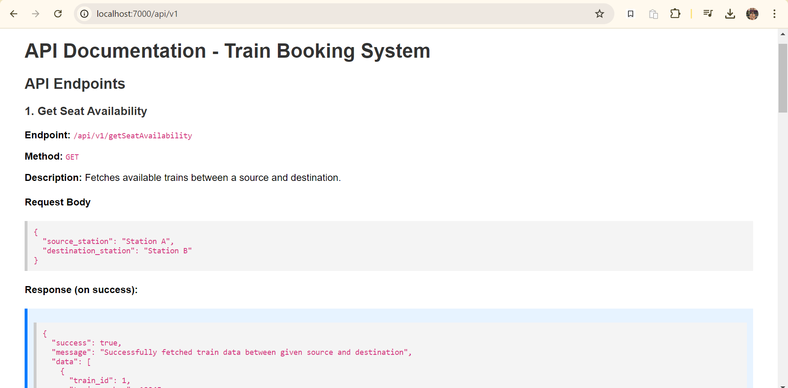

# Train Booking System

## Overview
The **Train Booking System** is a RESTful API built using Node.js and PostgreSQL that allows users to:
- Check seat availability on trains between a given source and destination.
- Book seats on a specific train with booking statuses such as `Confirmed`, `Waitlisted`, and `Pending`.

## Features
- **Get Seat Availability**: Users can view available trains between a source and destination.
- **Book a Seat**: Users can book seats for a specific train, and the system handles booking status automatically.
  
## Tech Stack
- **Node.js**: JavaScript runtime for server-side logic.
- **Express.js**: Framework for building RESTful APIs.
- **PostgreSQL**: Relational database for managing train, booking, and user data.
- **pg**: PostgreSQL client for Node.js.
- **dotenv**: Loads environment variables from a `.env` file.
- **jsonwebtoken (JWT)**: For user authentication and authorization.
- **Bcrypt**: A library to help you hash passwords.
## Table of Contents
- [Prerequisites](#prerequisites)
- [Installation](#installation)
- [Environment Variables](#environment-variables)
- [Database Setup](#database-setup)
- [API Endpoints](#api-endpoints)
  - [Get Seat Availability](#1-get-seat-availability)
  - [Book a Seat](#2-book-a-seat)
- [Error Handling](#error-handling)
- [Database Schema](#database-schema)
- [License](#license)

## Prerequisites
Ensure you have the following installed:
- **Node.js** (v14.x or higher)
- **PostgreSQL** (v12.x or higher)
- **Postman** or any API testing tool to test the API endpoints.

## Installation

### 1. Clone the Repository
\`\`\`bash
git clone <repository-url>
cd train-booking-system
\`\`\`

### 2. Install Dependencies
\`\`\`bash
npm install
\`\`\`

### 3. Set Up PostgreSQL Database
Ensure PostgreSQL is installed and running on your machine. Set up your database and configure the credentials in the `.env` file.

### 4. Create `.env` File
Create a `.env` file in the root directory with the following keys:

\`\`\`bash
# PostgreSQL Configuration
POSTGRES_USER=your_postgres_username
POSTGRES_PASSWORD=your_postgres_password
DATABASE_NAME=your_database_name
POSTGRES_HOST=localhost
POSTGRES_PORT=5432
PORT=7000


# JWT Secret Keys
JWT_SECRET_KEY=your_jwt_secret_key
JWT_ADMIN_SECRET_KEY=your_admin_jwt_secret_key
\`\`\`

### 5. Database Setup and Migration
Once the database is ready and environment variables are set, run the app to create tables and migrate the schema:
\`\`\`bash
npm start
\`\`\`
The application will connect to PostgreSQL and automatically create the required tables such as \`users\`, \`train\`, \`booking\`, and \`blacklist\`.


## API Endpoints
### 1. Register User
- **Endpoint**: `/api/v1/` or `/`
- **Method**: `GET`
- **Description**: Fetches a API Documentation - Train Booking System




### 2. Register User
- **Endpoint**: `/api/v1/register`
- **Method**: `POST`
- **Description**: Creates a new user account.
- **Request Body**:
  ```json
  {
    "username": "Nazim Qureshi",
    "email": "nazim@example.com",
    "password": "password123"
  }
  ```
- **Response** (on success):
  ```json
  {
    "success": true,
    "message": "User successfully registered"
  }
  ```

### 3. Login User
- **Endpoint**: `/api/v1/login`
- **Method**: `GET`
- **Description**: Logs in the user and generates an authentication token.
- **Request Query**:
  ```json
  {
    "username": "hecodeit",
    "password": "password123"
  }
  ```
- **Response** (on success):
  ```json
  {
    "success": true,
    "message": "User successfully logged in",
    "token": "jwt_token_here"
  }
  ```

### 4. Logout User
- **Endpoint**: `/api/v1/logout`
- **Method**: `GET`
- **Description**: Logs out the current user and invalidates the authentication token.
- **Response** (on success):
  ```json
  {
    "success": true,
    "message": "User successfully logged out"
  }
  ```

### 5. Add Train (Admin Only)
- **Endpoint**: `/api/v1/admin/add-train`
- **Method**: `POST`
- **Description**: Adds a new train to the system. Only accessible to admins.
- **Request Body**:
  ```json
  {
    "train_number": 12345,
    "source_station": "Mumbai",
    "destination_station": "Lucknow",
    "total_seats": 100
  }
  ```
- **Response** (on success):
  ```json
  {
    "success": true,
    "message": "Train successfully added"
  }
  ```

### 6. Get Seat Availability
- **Endpoint**: `/api/v1/getSeatAvailability`
- **Method**: `GET`
- **Description**: Fetches available trains between a source and destination.
- **Request Body**:
  ```json
  {
    "source_station": "DELHI",
    "destination_station": "BANGALORE"
  }
  ```
- **Response** (on success):
  ```json
  {
    "success": true,
    "message": "Successfully fetched train data between given source and destination",
    "data": [
      {
        "train_id": 1,
        "train_number": 12345,
        "source_station": "MUMBAI",
        "destination_station": "DELHI",
        "total_seats": 100,
        "available_seats": 50
      }
    ]
  }
  ```

### 7. Book a Seat
- **Endpoint**: `/api/v1/bookSeat`
- **Method**: `POST`
- **Description**: Books a seat for a user on a specific train. The system automatically updates the seat availability and manages booking status.
- **Request Body**:
  ```json
  {
    "train_number": 12345,
    "source_station": "MUMBAI",
    "destination_station": "CHANDIGARH"
  }
  ```
- **Response** (on success):
  ```json
  {
    "success": true,
    "message": "Successfully booked the ticket",
    "booking_status": "Confirmed | Cancelled | Waitlisted (>=-49)"
  }
  ```

## Database Schema

### 1. **Users Table**
| Column       | Type          | Description                       |
|--------------|---------------|-----------------------------------|
| \`user_id\`    | SERIAL        | Primary key, unique user ID       |
| \`username\`   | VARCHAR(255)  | Unique username for each user     |
| \`email\`      | VARCHAR(255)  | User's email address              |
| \`role\`       | INT           | User role (0 for normal, 1 for admin) |
| \`auth_token\` | VARCHAR(255)  | JWT token for authentication      |

### 2. **Train Table**
| Column             | Type          | Description                               |
|--------------------|---------------|-------------------------------------------|
| \`train_id\`         | SERIAL        | Primary key, unique train ID              |
| \`train_number\`     | INT           | Unique train number                       |
| \`source_station\`   | VARCHAR(255)  | Source station of the train               |
| \`destination_station\` | VARCHAR(255)| Destination station of the train          |
| \`total_seats\`      | INT           | Total seats on the train                  |
| \`available_seats\`  | INT           | Number of available seats                 |
| \`last_updated_by\`  | INT           | User ID of the person who updated the train details |
| \`created_at\`       | TIMESTAMP     | Timestamp of when the train record was created |
| \`updated_at\`       | TIMESTAMP     | Timestamp of the last update to the train record |

### 3. **Booking Table**
| Column            | Type             | Description                               |
|-------------------|------------------|-------------------------------------------|
| \`booking_id\`      | SERIAL           | Primary key, unique booking ID            |
| \`user_id\`         | INT              | Foreign key to \`users\` table              |
| \`train_id\`        | INT              | Foreign key to \`train\` table              |
| \`booking_status\`  | ENUM             | Booking status (\`Confirmed\`, \`Waitlisted\`, \`Cancelled\`) |
| \`booking_time\`    | TIMESTAMP        | Timestamp of when the booking was made    |

## Error Handling
The system returns appropriate HTTP status codes and error messages:
- **400**: Bad request (e.g., missing or invalid fields).
- **404**: Not found (e.g., train or user not found).
- **500**: Internal server error (e.g., database issues).

Example Error Response:
\`\`\`json
{
  "success": false,
  "message": "Error booking the ticket",
  "error": "Train not found"
}
\`\`\`

## License
Resources Used: GfG, StackOverflow and Medium

## License
This project is licensed under the MIT License.


